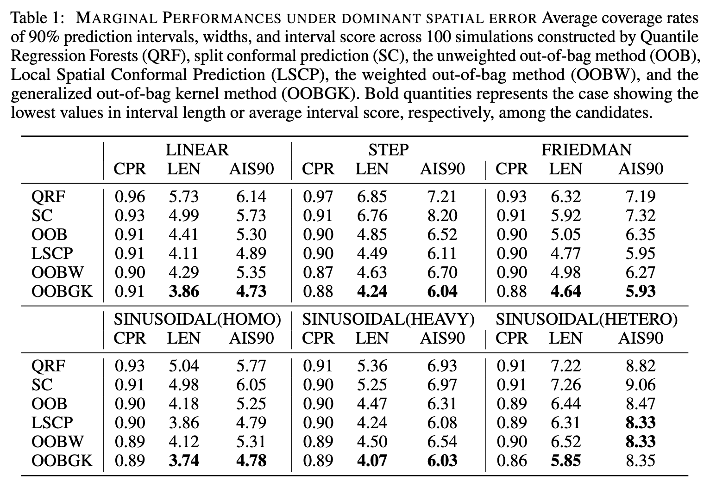
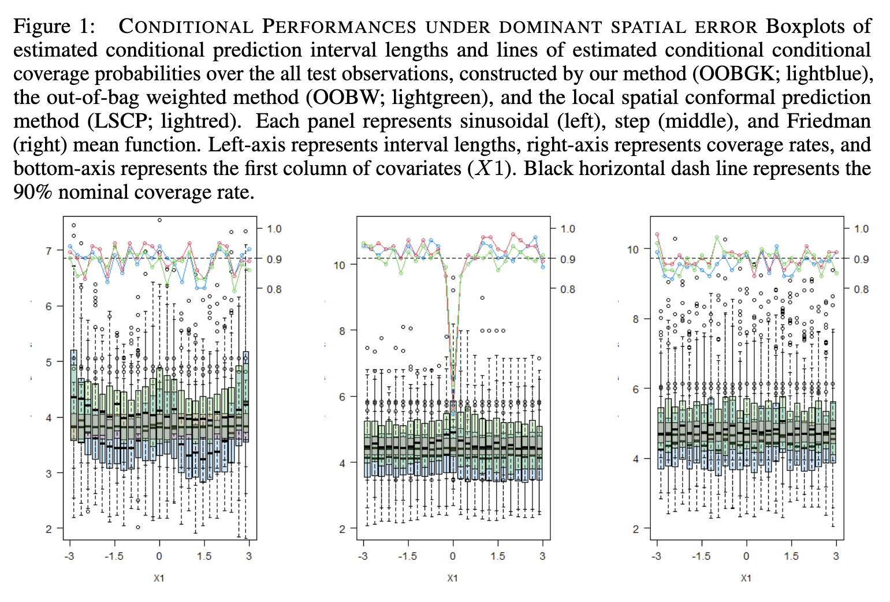
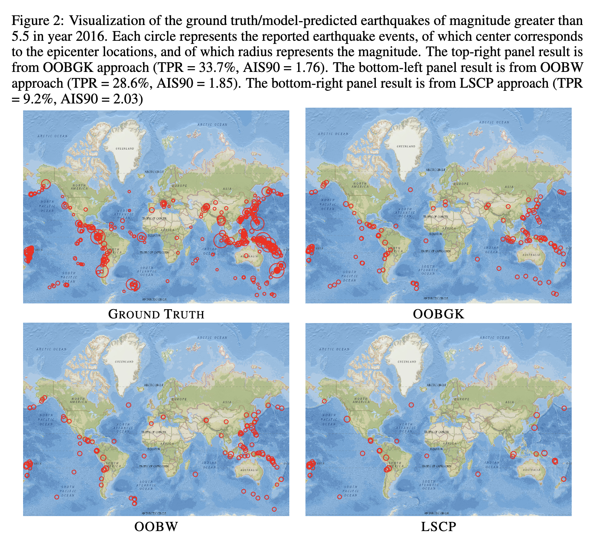

# Random Forest Prediction Intervals for Spatially Dependent Data

<b>Abstract: </b> 
Random forest is a popular machine learning technique that is often used on spatial data for prediction. However, in practice, the spatial dependence of a response variable has typically been ignored in constructing prediction intervals with random forest algorithms, which may result in either low accuracy or low efficiency in such applications. We propose a generalized version of out-of-bag guided random forest prediction intervals, which is well-adapted for spatially dependent data. We use dependency-adjusted regression tree (DART) node-splitting and a novel non-parametric kernel out-of-bag estimator to estimate the underlying conditional prediction error distribution. Theoretical results on the asymptotic consistency of our approach are obtained. Empirical simulation studies and the analysis of global earthquake data indicate that our proposed prediction interval provides good coverage, and is generally more efficient than  existing approaches when observations are spatially dependent. 

<b>Summary Results: </b> 
  
Table 1 shows marginal performances under dominant spatial error.

  
Figure 1 describes conditional performances under dominant spatial error.

  
Figure 2 shows the visualization of the ground truth/model-predicted earthquakes of magnitude greater than 5.5 in year 2016.

<b>Code: </b> 
[`Main_spRFPI.R`](https://github.com/junpeea/spRFPI/blob/main/Codes/Main_spRFPI.R) includes the code to provide main tables and figues in our Result session.

[`RFGLS_support_YBJ.R`](https://github.com/junpeea/spRFPI/blob/main/Codes/RFGLS_support_YBJ.R) includes the main library function codes.

<b>Reference pages: </b> 
Data source: [earthquake-database](https://www.kaggle.com/datasets/usgs/earthquake-database) 
